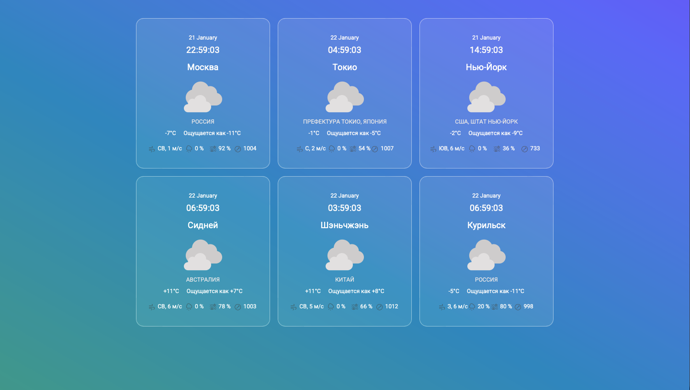
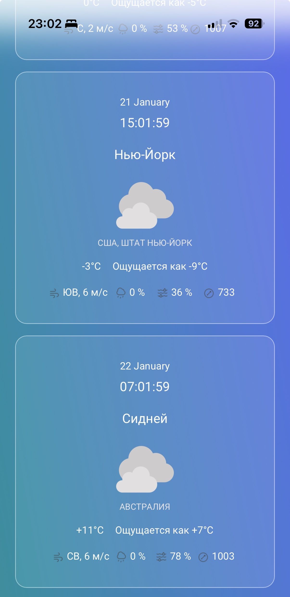
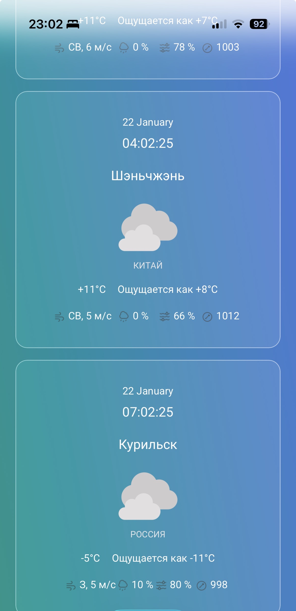
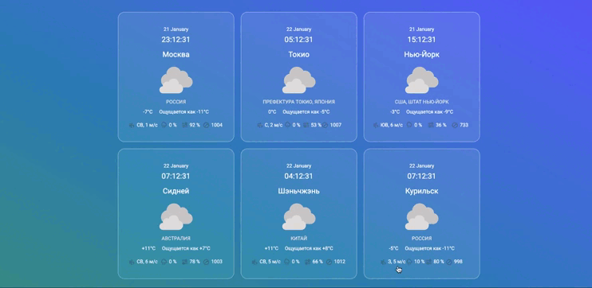

# Weather Dashboard

**Краткое описание:** Адаптивная панель для отслеживания погоды в нескольких городах с возможностью перетаскивания карточек и использованием реального API.

Демо: **[Ссылка на демо]**

---

## Скриншоты

### Главный экран



### Мобильная версия

<div align="start">
  
  
</div>

### Демонстрация работы



---

## 🎯 Цель проекта

Создать полнофункциональное веб-приложение для практического применения ключевых навыков фронтенд-разработки: работа с внешними API, управление состоянием в Redux Toolkit, реализация интерактивности (drag&drop) и создание адаптивного интерфейса.

---

## 🚀 Установка и запуск

1.  Клонируйте репозиторий:

    ```bash
    git clone [your-repo-url]
    cd weather-dashboard
    ```

2.  Установите зависимости:

    ```bash
    npm install
    ```

3.  Запустите проект:

    ```bash
    npm run dev
    ```

4.  Откройте [http://localhost:3173](http://localhost:3173) в браузере.

### Production сборка и запуск

5.  Сборка production версии:

    ```bash
    npm run build
    ```

    Или с очисткой кэша:

    ```bash
    npm run build:clean
    ```

6.  Предпросмотр production сборки:

    ```bash
    npm run preview
    ```

---

## ⚙️ Функциональность

- **Отображение погоды:** Карточки с детальной информацией (температура, влажность, скорость ветра, погодные условия) для каждого города.
- **Drag & Drop:** Возможность менять порядок карточек перетаскиванием (реализовано на нативных событиях браузера).
- **Адаптивный дизайн:** Адаптация под мобильные устройства, планшеты, десктопы и широкие экраны.
- **Реальное время с таймзонами:** Отображение реального времени для каждой локации с учётом таймзоны данной локации.
- **Работа с API:** Получение актуальных метеоданных с Open-Meteo API.
- **Динамическое обновление:** Автообновление данных каждые 10 минут.

---

## 🛠 Технологический стек

**Frontend:**

- **Язык:** TypeScript
- **Фреймворк:** React (компоненты + хуки)
- **Управление состоянием:** Redux Toolkit (со слайсами), createAsyncThunk для API
- **Стилизация:** Tailwind CSS
- **Вёрстка:** CSS Grid для разметки

**Инструменты:**

- **Сборка:** Vite
- **Линтинг:** ESLint + Prettier
- **Контроль версий:** Git
- **Работа со временем:** moment-timezone
- **Работа с внешним API:** openmeteo

---

## 🏗 Архитектура и ключевые решения

1.  **Структура состояния (Redux Toolkit):**
    - `weatherSlice` — управление данными о погоде и управление запросами к внешнему API.
    - Селекторы с мемоизацией через `createSelector` для производительности (селекторы по индексу для взятия конкретного города).

2.  **Drag & Drop реализация:**
    - Нативные события (`dragstart`, `dragover`, `drop`).
    - Перестроение порядка элементов через внутренний стейт компонента.

3.  **Адаптивная вёрстка:**
    - Mobile-first подход.
    - CSS Grid для автоматического перестроения компонентов.
    - Breakpoints для построения интерфейса под различные экраны.

---

## 🔮 Планы по доработке

- Добавить поиск и добавление новых локаций.
- Удаление текущих локаций.
- Реализовать подробный прогноз на 7 дней.
- Сохранять порядок карточек в localStorage для сохранения состояния между перезагрузками сервиса.
- Написать unit-тесты для компонентов и логики.

---

## 📝 Что я практиковала в этом проекте

✅ Работу с реальным REST API.
✅ Управление состоянием через Redux Toolkit.
✅ Типизацию на TypeScript.
✅ Реализацию ванильной drag&drop.
✅ Mobile-first адаптивную вёрстку.
✅ Grid сетку.
✅ Чистую и модульную архитектуру проекта.
